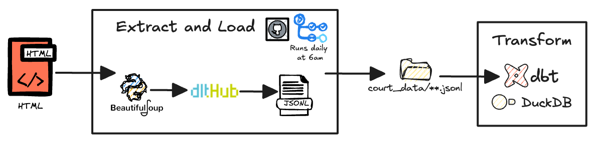

# Daily Court Scraper

A lightweight web scraper powered by `dlt` that retrieves the daily court schedule from the UK [Xhibit Court List](http://xhibit.justice.gov.uk/court_lists.htm). The scraper runs automatically at **6 AM daily** via a GitHub Action and outputs data in JSONL format to the `court_data` directory.

---

## Data Pipeline Overview

This pipeline follows a structured workflow, as illustrated below:



### Pipeline Stages

1. **Scraper:**
   The process begins by retrieving the daily court schedule from the Xhibit Court List. A Python script using `requests` and `beautifulsoup4` is responsible for extracting the data.

2. **Extract-Load with `dlt`:**
   The scraped data is passed to `dlt`, which **extracts, normalises, and loads** it into structured **JSONL files**.

3. **Transformation with `dbt`:**
   The structured data is then processed using `dbt`, which applies transformations to create a model optimised for analysis. The transformations are stored in the `court_transformer` directory.

### Orchestration

The **extract-load process is fully automated** using a [GitHub Action](./.github/workflows/update-court-data.yml) that runs at **6 AM daily**. This action triggers the scraper, processes the data using `dlt`, and saves the output to the `court_data` directory. Each dataset is **timestamped**, allowing users to locate data for a specific date.

---

## Getting Started

### Dependency Management

This project uses [`uv`](https://docs.astral.sh/uv/) to manage dependencies via `pyproject.toml`. Dependencies are locked in the `uv.lock` file.

To install dependencies, run:
```sh
uv pip install -r pyproject.toml --all-extras
```

To update dependencies, use:
```sh
uv sync pyproject.toml
```

---

## Running the Scraper (`dlt`)

To manually execute the scraper, run:
```sh
python3 -m main.py
```
This retrieves the latest court schedule and saves the output to the `court_data` directory.

---

# dbt

The `dbt` project transforms raw data into a structured format. It is located within the `dbt` directory under `court_scraper_dbt`.

Before running `dbt`, ensure:
- Dependencies are installed (see [Dependency Management](#dependency-management)).
- The `dbt` profile is configured. To set the profile directory, run:

  ```sh
  export DBT_PROFILES_DIR='../.dbt'
  ```

> 💡 **Tip:** To persist this setting, add the export command to your `.bashrc` or `.zshrc` file.

---

## Running dbt

The `dbt` models are stored in `court_transformer` and are structured as follows:

- **Staging:** Loads raw data into the database.
- **Transform:** Applies transformations to structure the data.

Run the transformations:
```sh
dbt run --select court_transformer
```

Run tests for data integrity:
```sh
dbt test --select court_transformer
```

For further details, refer to the [dbt documentation](https://docs.getdbt.com/).

---

## Linting and Code Formatting

### Ruff

All linting is handled by `ruff`. Configuration can be found in `pyproject.toml`.

Run linting and formatting:
```sh
ruff check && ruff format
```

To automatically fix issues:
```sh
ruff check --fix
```

---

## CI/CD

GitHub Actions for automation are stored in `.github/workflows/`.

### Workflows:
- **[lint-and-format.yml](./.github/workflows/lint-and-format.yml)** → Runs linting and formatting on PRs to `main`.
- **[daily-scraper.yml](./.github/workflows/daily-scraper.yml)** → Executes the scraper daily at **6 AM**.